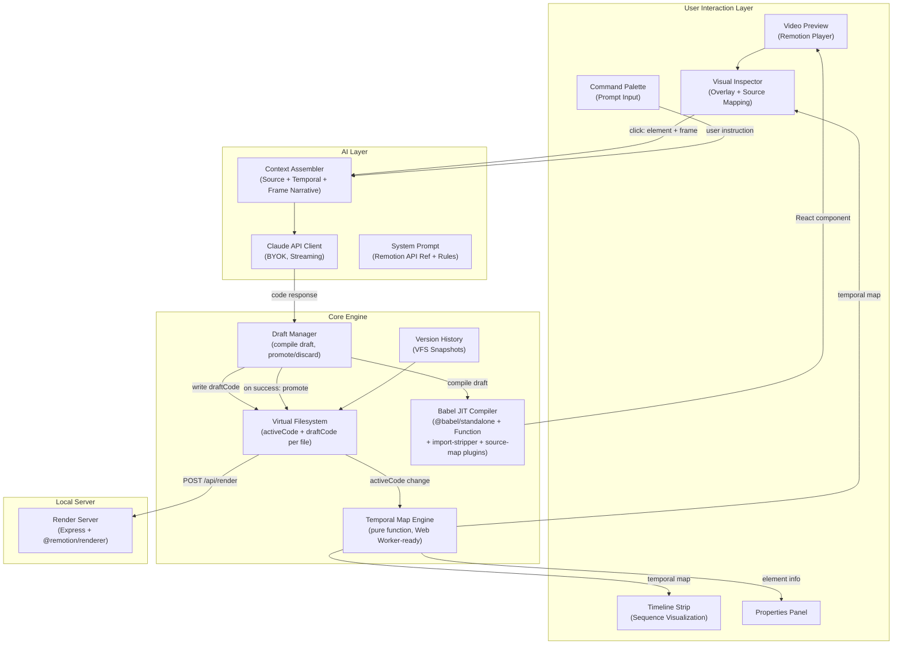

# MotionLM — AI-First Visual Video Editor with Temporal Intelligence

## What We Are Building

MotionLM is a browser-based visual editor for programmatic videos built with Remotion. The core interaction: a user watches a video preview, clicks any element at any point in time, describes an edit in natural language ("make this text bounce in from the left"), and the editor applies the change live. Under the hood, the click resolves to source code, the editor assembles a temporal context bundle (what is animating, what depends on what, where in the timeline the user clicked), sends that context plus the instruction to Claude via API, and applies the returned code diff with live preview.

**The novel technical contribution** is temporal awareness. In a web app, a button is always a button. In a video, the same element might be invisible at frame 0, mid-animation at frame 45, fully visible at frame 90, and fading out at frame 120. When a user clicks and says "make this bigger," the system must understand WHERE in time they clicked and WHAT that implies. No existing tool solves this — Remotion's AI template does full regeneration with no frame awareness; Cursor's visual editor has no concept of time; traditional NLEs use keyframes, not code.

**The key insight**: Remotion code IS the temporal representation. Every `interpolate()` call declares an animation range. Every `spring()` call declares a physics-based motion. Every `<Sequence>` declares a time window. We extract temporal information from code via AST analysis, not from rendered frames.

---

## Critical Analysis: What Changes From the Original Prompt

### 1. Vite + React, Not Next.js

The editor is a pure client-side SPA. There are no server-rendered pages, no SEO needs, no API routes for the prototype. Next.js adds SSR hydration complexity, routing constraints, and bundle overhead that provides zero value for a canvas-style editor application. **Use Vite + React 19 + TailwindCSS v4.** If we later need a marketing site or API routes for cloud rendering, those are separate concerns.

### 2. @babel/parser for AST, Not TypeScript Compiler API

The original prompt calls for `typescript` compiler API for the temporal map engine. The `typescript` package is ~50MB, designed for Node.js, and dramatically over-powered for what we need. All target patterns (Sequence boundaries, interpolate/spring calls, useCurrentFrame tracing) are syntactic patterns detectable via Babel AST traversal. Since we already load `@babel/standalone` for JIT compilation, we get `@babel/parser` and `@babel/traverse` effectively for free. One dependency, two uses. Run the temporal engine entirely in the browser.

### 3. Single Project, Not Monorepo (Yet)

Turborepo with 3 packages before writing a single feature line is premature optimization. Start with a single Vite project with clean internal boundaries (`src/engine/`, `src/inspector/`, `src/editor/`). Extract to publishable npm packages when the APIs are proven and there is real demand for standalone use. This saves weeks of tooling configuration.

### 4. @babel/standalone for Compilation, Not esbuild-wasm

Remotion's own AI SaaS template uses `@babel/standalone` + `Function` constructor. This is battle-tested. esbuild-wasm has severe browser limitations (500MB+ memory for large packages, Go-to-WASM overhead). For the MVP, single-file compositions with Babel are sufficient. Multi-file bundling (requiring esbuild-wasm or a custom module resolver) is a Phase 2 concern.

### 5. React 19 Breaks Fiber Source Mapping

React 19 removed `__source`, `__self`, and `_debugSource` from fibers (PR #28265). The Babel plugin approach (injecting `data-motionlm-`* attributes) is not just recommended — it is mandatory. There is no fiber-based fallback.

### 6. Focused MVP Temporal Engine

The full dependency graph described in the prompt is a Phase 2 feature. For the core edit loop, we need: (a) which Sequence contains the clicked element, (b) what animations the element has, (c) the current frame position relative to those animations. This covers 90% of edit scenarios and can be built in days, not weeks.

### 7. Apply Diffs After Full Response, Not Mid-Stream

Streaming partial code and attempting incremental compilation mid-stream causes constant parse errors and UI flicker. Better: stream Claude's response for visual progress feedback in the prompt bar, but apply the code change only when a complete code block is received. This is more reliable and the perceived speed difference is negligible (1-3 seconds).

### 8. Error Recovery is First-Class

When Claude returns code that does not compile, the editor must: (a) display the compilation error clearly, (b) automatically revert to the last working VFS state, (c) offer to send the error back to Claude for a fix attempt. This is not a polish feature — without it, the product is unusable.

### 9. Remotion Licensing Must Be Addressed

Under Remotion's licensing model, building a video creation tool for end users falls under the "Automator" tier ($0.01/render, $100/month minimum for companies with 4+ employees). This affects the open-source strategy. The open-source packages (temporal engine, inspector) do not require a Remotion license since they are tooling. The hosted editor product does. Plan for this cost from day one.

### 10. Command Palette Over Floating Prompt Bar

A floating prompt bar near the clicked element sounds elegant but creates practical problems: it obscures the video preview, is hard to position in corner cases (elements at viewport edges), and conflicts with the timeline. A centered command palette (Cmd+K style, like Linear or Raycast) with selection context shown inline is more reliable and equally fast.

### 11. Babel Visitor for Import Removal, Not Regex

Remotion's own template strips imports with `/^import\s+.*$/gm` — this only matches single-line imports. MotionLM handles user-edited code and Claude output that may contain multiline imports, aliased imports, or imports with inline comments. Since we already run `Babel.transform()`, add a tiny visitor plugin that removes `ImportDeclaration` and `ExportNamedDeclaration` wrapper nodes during the transformation phase. This is 100% reliable regardless of import formatting and adds zero overhead (the AST is already being parsed).

### 12. Draft State for Failed Edits, Not Immediate Revert

When Claude returns code that does not compile, immediately reverting the VFS loses the context of Claude's mistake and prevents the user from manually fixing a simple typo. Instead, implement a "draft state" in the VFS: Claude's output is written to a `draftCode` field (not the active source). If compilation fails on the draft, the preview stays on the last working `activeCode`, but the broken draft and compiler error are shown in the properties/code panel. This enables three recovery paths: (a) the user manually fixes the draft, (b) an automatic retry sends the broken code + compiler trace back to Claude, (c) the user discards the draft entirely.

### 13. Single Zustand Store With Slices, Not Separate Stores

The editor's state domains are tightly coupled: a VFS change triggers a temporal map rebuild which triggers selection validation which triggers a properties panel update. With separate stores, this cascade requires subscription chains prone to ordering bugs and stale reads between stores. A single Zustand store with the slices pattern allows atomic updates across all domains in one `set()` call, preventing any intermediate inconsistent UI states.

### 14. Local Render Server for Export, Not Browser-Only

`@remotion/renderer` requires Chrome Headless Shell and Node.js — it cannot run in a browser. The plan's "pure SPA" framing contradicts local export. The fix: MotionLM ships as a local dev tool. Running `npx motionlm` starts both the Vite frontend and a lightweight local render server (Express/Fastify). The SPA sends a `POST /api/render` request to this local server, which writes VFS files to a temp directory, executes `renderMedia()`, and streams progress back. This is how Remotion Studio itself works.

### 15. No Screenshot in Claude Context (Initially)

Sending a screenshot via `html2canvas` is risky: Remotion uses complex CSS transforms and `AbsoluteFill` that html2canvas routinely misrenders. More importantly, Claude already receives the full source code (exact CSS values, colors, sizes), the temporal map (exact animation parameters), and a frame-position narrative. A screenshot is redundant and risks hallucinations where Claude tries to match pixel output rather than editing code semantically. Start without it. Add screenshot support in a later phase using `html-to-image` or server-side `renderStill()` if user testing reveals it is needed.

---

## Revised Architecture




---

## Tech Stack (Revised)


| Concern                | Choice                                                        | Rationale                            |
| ---------------------- | ------------------------------------------------------------- | ------------------------------------ |
| Framework              | **Vite 6 + React 19**                                         | Pure SPA, no SSR needed, fastest DX  |
| Language               | **TypeScript** throughout                                     |                                      |
| Styling                | **Tailwind CSS v4**                                           |                                      |
| State                  | **Zustand**                                                   | Simple, performant, good devtools    |
| Video Engine           | **Remotion v4** (`@remotion/player`)                          | Proven, well-documented              |
| AST Parsing            | **@babel/parser + @babel/traverse**                           | Already loaded via @babel/standalone |
| In-Browser Compilation | **@babel/standalone** + `Function` constructor                | Remotion's proven approach           |
| AI                     | **Anthropic API** (BYOK, claude-sonnet-4-20250514 default)    |                                      |
| UI Components          | **Radix UI** primitives                                       | Accessible, unstyled, composable     |
| Icons                  | **Lucide React**                                              |                                      |
| Export (local)         | **@remotion/renderer** via local Express render server        | Cannot run in browser; needs Node.js |
| Export (cloud)         | **@remotion/lambda** (Phase 6)                                | Serverless, pay-per-render           |


---

## Design System — Apple Liquid Glass

MotionLM uses Apple's Liquid Glass design language (iOS 26 / macOS Tahoe): frosted glass panels floating over a near-black base, with specular highlights, backdrop blur, and springy micro-interactions. Implemented entirely via Tailwind v4 + CSS variables — no inline styles, no CSS modules, no extra dependencies.

### Critical Rule: Blur Contamination

No element that overlaps the Remotion Player may ever have `backdrop-filter` set. Glass panels (FileTree, Properties, Timeline, Toolbar) are adjacent to the player in the CSS Grid — they blur the dark base behind them, which is correct. The inspector Overlay sits directly on top of the player and must have zero backdrop-filter. Violating this blurs the video output.

### Color Palette

```
Base surfaces:
  --color-base:        #08080a    (app background, deepest layer)
  --color-base-raised: #0d0d10
  --color-base-muted:  #111116

Glass backgrounds (opacity tiers by elevation):
  --glass-bg-0: rgba(255,255,255,0.04)   (inset wells)
  --glass-bg-1: rgba(255,255,255,0.07)   (primary panels: FileTree, Properties, Timeline)
  --glass-bg-2: rgba(255,255,255,0.11)   (toolbar, panel headers)
  --glass-bg-3: rgba(255,255,255,0.18)   (command palette, modals)

Glass borders:
  --glass-border-subtle:  rgba(255,255,255,0.08)
  --glass-border-default: rgba(255,255,255,0.13)
  --glass-border-strong:  rgba(255,255,255,0.22)

Text:
  --text-primary:   rgba(255,255,255,0.94)
  --text-secondary: rgba(255,255,255,0.62)
  --text-tertiary:  rgba(255,255,255,0.38)

State tints (composed with glass-panel for error/warning/selection states):
  --accent-blue-glass:  rgba(59,130,246,0.10)
  --accent-amber-glass: rgba(245,158,11,0.10)
  --accent-red-glass:   rgba(239,68,68,0.10)
  --accent-green-glass: rgba(34,197,94,0.10)
```

All text passes WCAG AA (4.5:1): primary ~14:1, secondary ~8.5:1, tertiary ~4.9:1.

### Tailwind Config Additions (`tailwind.config.ts`)

```typescript
boxShadow: {
  'glass-sm': '0 4px 16px rgba(0,0,0,0.40), inset 0 1px 0 rgba(255,255,255,0.08)',
  'glass-md': '0 8px 32px rgba(0,0,0,0.50), inset 0 1px 0 rgba(255,255,255,0.14)',
  'glass-lg': '0 16px 48px rgba(0,0,0,0.60), inset 0 1px 0 rgba(255,255,255,0.20)',
  'glass-xl': '0 24px 64px rgba(0,0,0,0.70), inset 0 1px 0 rgba(255,255,255,0.28)',
  'glow-blue':  '0 0 20px rgba(59,130,246,0.30)',
  'glow-amber': '0 0 20px rgba(245,158,11,0.30)',
  'glow-red':   '0 0 20px rgba(239,68,68,0.30)',
},
transitionTimingFunction: {
  'spring-out': 'cubic-bezier(0.34, 1.56, 0.64, 1)',   // springy overshoot for modals
  'ease-glass': 'cubic-bezier(0.25, 0.46, 0.45, 0.94)', // smooth for color/opacity
},
keyframes: {
  'glass-appear': {
    '0%':   { opacity: '0', transform: 'scale(0.96) translateY(4px)' },
    '100%': { opacity: '1', transform: 'scale(1) translateY(0)' },
  },
  'shimmer': { '0%,100%': { opacity: '0.4' }, '50%': { opacity: '0.8' } },
},
animation: {
  'glass-appear': 'glass-appear 250ms cubic-bezier(0.34,1.56,0.64,1) forwards',
  'shimmer':      'shimmer 2s ease-in-out infinite',
},
```

Note: `inset 0 1px 0 rgba(255,255,255,N)` inside `box-shadow` IS the specular highlight — no pseudo-element needed.

### CSS Utility Classes (`src/index.css`)

Four glass tiers defined as `@layer utilities`:

```css
.glass-panel    { background: var(--glass-bg-1); backdrop-filter: blur(16px); -webkit-backdrop-filter: blur(16px); border: 1px solid var(--glass-border-default); box-shadow: 0 8px 32px rgba(0,0,0,0.50), inset 0 1px 0 rgba(255,255,255,0.14); }
.glass-elevated { background: var(--glass-bg-2); backdrop-filter: blur(20px); -webkit-backdrop-filter: blur(20px); border: 1px solid var(--glass-border-strong);  box-shadow: 0 4px 16px rgba(0,0,0,0.40), inset 0 1px 0 rgba(255,255,255,0.20); }
.glass-modal    { background: var(--glass-bg-3); backdrop-filter: blur(24px); -webkit-backdrop-filter: blur(24px); border: 1px solid var(--glass-border-strong);  box-shadow: 0 24px 64px rgba(0,0,0,0.70), inset 0 1px 0 rgba(255,255,255,0.28); }
.glass-well     { background: var(--glass-bg-0); border: 1px solid var(--glass-border-subtle); border-radius: 8px; }

/* State tints — compose with glass-panel */
.glass-tint-blue  { background: var(--accent-blue-glass);  border-color: rgba(59,130,246,0.25);  box-shadow: 0 0 20px rgba(59,130,246,0.15); }
.glass-tint-amber { background: var(--accent-amber-glass); border-color: rgba(245,158,11,0.25);  box-shadow: 0 0 20px rgba(245,158,11,0.15); }
.glass-tint-red   { background: var(--accent-red-glass);   border-color: rgba(239,68,68,0.25);   box-shadow: 0 0 20px rgba(239,68,68,0.15); }

/* will-change only during hover — not permanently */
.glass-hover:hover     { background: rgba(255,255,255,0.09); will-change: backdrop-filter; transition: background-color 150ms ease-out; }
.glass-hover:not(:hover) { will-change: auto; }
```

Also include in `@layer base`: `-webkit-font-smoothing: antialiased`, `overflow: hidden` on body, and `@media (prefers-reduced-motion: reduce)` that sets all animation/transition durations to `0.01ms`.

### Layout Grid (`EditorLayout.tsx`)

```
grid-rows: [toolbar 44px] [main 1fr] [timeline 160px]
grid-cols: [filetree 240px] [preview 1fr] [properties 280px]
```

- Toolbar: `col-span-3 glass-elevated border-b`
- FileTree: `glass-panel border-r`
- Preview: `bg-[var(--color-base)]` — NO glass class, NO backdrop-filter
- Properties: `glass-panel border-l`
- Timeline: `col-span-3 glass-elevated border-t`

Adjacent panels share one border — use `border-r` on left panel, `border-l` on right, never both.

### Panel State Variants

**PropertiesPanel:**
- Normal: `glass-panel`
- Draft warning: `glass-panel glass-tint-amber border-amber-500/20 transition-colors duration-200`
- Compile error: `glass-panel glass-tint-red border-red-500/20 transition-colors duration-200`

Error display inside panel:
```tsx
<div className="glass-well glass-tint-amber mx-3 my-2 p-3 rounded-xl border border-amber-500/30">
  <p className="text-xs text-amber-300 font-medium mb-1">Compilation error in draft</p>
  <code className="text-xs text-amber-200/70 font-mono block whitespace-pre-wrap">{error}</code>
</div>
```

**TimelinePanel sequence blocks:**
- Normal: `glass-well hover:bg-white/[0.08]`
- Selected: `glass-tint-blue border-blue-500/30 shadow-[0_0_12px_rgba(59,130,246,0.25)]`
- Playhead: `w-px bg-red-400 shadow-[0_0_8px_rgba(248,113,113,0.8)] cursor-ew-resize`

### Interactive Element Base Pattern

Applied to all buttons, file items, timeline blocks:
```tsx
className="text-[var(--text-secondary)] hover:text-[var(--text-primary)]
           hover:bg-white/[0.06] active:bg-white/[0.09] active:scale-[0.97]
           focus-visible:ring-1 focus-visible:ring-blue-400/60
           transition-all duration-150 ease-out
           disabled:opacity-40 disabled:cursor-not-allowed"
```

### Command Palette (`CommandPalette.tsx`)

Uses Radix UI Dialog + cmdk. The scrim fades in (creating perceived glass materialization); the panel itself has static blur (animating backdrop-filter is expensive).

```tsx
// Scrim
<Dialog.Overlay className="fixed inset-0 bg-black/40 backdrop-blur-sm z-50 animate-[fade-in_200ms_ease-out_forwards]" />

// Panel
<Dialog.Content className="fixed inset-0 flex items-start justify-center pt-[20vh] z-50">
  <div className="glass-modal rounded-2xl w-[580px] max-w-[90vw] overflow-hidden animate-glass-appear">
    // Context bar: selection pill with blue-400 pulse dot
    // cmdk input: bg-transparent, caret-blue-400, border-b border-[var(--glass-border-subtle)]
    // Result items: aria-selected:bg-white/[0.08] aria-selected:shadow-glass-sm
    // Streaming bar: blue-400 shimmer dot + "Generating edit..." in text-tertiary
  </div>
</Dialog.Content>
```

### Version History (`VersionHistory.tsx`)

Slide-in side sheet from right edge (overlaps Properties panel):
```tsx
<aside className={cn(
  "fixed top-0 right-0 h-full w-72 z-40 glass-modal border-l border-[var(--glass-border-strong)]",
  "transition-transform duration-[350ms] ease-[cubic-bezier(0.25,0.46,0.45,0.94)]",
  isOpen ? "translate-x-0" : "translate-x-full"
)}>
```

### Inspector Overlay Stacking

```
z-50: Command Palette (glass-modal — backdrop-filter OK, doesn't overlap player)
z-40: Version History sheet (glass-modal — slides over properties panel, not player)
z-20: Toolbar (glass-elevated)
z-10: Inspector Overlay (NO backdrop-filter, NO background — transparent hit area only)
 z-0: Remotion Player
      Glass panels (adjacent in grid, never overlapping player)
      Dark base (#08080a)
```

Highlight boxes in `highlight.ts` are border-only (no fill background):
```
hover:    border: 1.5px solid rgba(59,130,246,0.60); box-shadow: 0 0 0 1px rgba(59,130,246,0.20) inset
selected: border: 2px solid rgba(59,130,246,0.90);   box-shadow: 0 0 16px rgba(59,130,246,0.40)
```

### Animation Reference

| Interaction | Duration | Easing | Properties |
|---|---|---|---|
| Command palette appear | 250ms | spring-out (0.34,1.56,0.64,1) | opacity, scale(0.96→1), translateY(4→0) |
| History panel slide | 350ms | ease-glass (0.25,0.46,0.45,0.94) | translateX |
| Button hover | 150ms | ease-out | background-color, color |
| Button press | 100ms | ease-out | scale(0.97), background-color |
| Glass tint change | 200ms | ease-out | background-color, border-color, box-shadow |
| Selection highlight | 100ms | ease-out | opacity, box-shadow |
| Dialog scrim | 200ms | ease-out | opacity |
| AI streaming dot | 2s | ease-in-out infinite | opacity (shimmer) |
| Playhead drag | 0ms | none | left (no easing on drag) |

### Design System Implementation Order

Before any feature code is written, implement in this order:
1. `tailwind.config.ts` — shadow tokens, keyframes, timing functions
2. `src/index.css` — `@theme` variables, glass utility classes, reduced-motion override
3. `src/editor/layout/EditorLayout.tsx` — grid shell establishes stacking contexts
4. `src/editor/layout/PreviewPanel.tsx` — most safety-critical (no blur over player)
5. All remaining panels, then CommandPalette, then VersionHistory

---

## Detailed Implementation Plan

### Phase 0: Foundation (Week 1)

**Goal**: A working Vite + React app with Remotion Player rendering a JIT-compiled composition from a virtual filesystem.

**Project Structure**:

```
motionlm/
  bin/
    motionlm.js                 # CLI entry: starts Vite + render server
  src/
    main.tsx                    # App entry
    App.tsx                     # Root layout
    store.ts                    # Single Zustand store (all slices composed here)
    engine/
      compiler.ts               # Babel JIT compilation pipeline
      babel-plugins/
        import-stripper.ts      # Babel visitor to remove ImportDeclaration nodes
        source-map.ts           # Babel visitor to inject data-motionlm-* attributes
      temporal/
        parser.ts               # AST parser for temporal map (pure function, no deps)
        types.ts                # Temporal map type definitions
    inspector/
      Overlay.tsx               # Click-to-select overlay
      highlight.ts              # Bounding box rendering
    editor/
      layout/
        EditorLayout.tsx        # Main layout shell
        PreviewPanel.tsx        # Player + overlay container
        TimelinePanel.tsx       # Sequence timeline strip
        PropertiesPanel.tsx     # Element info + animations + draft error display
        FileTreePanel.tsx       # VFS file browser
      prompt/
        CommandPalette.tsx      # Cmd+K prompt interface
        ContextDisplay.tsx      # Shows selection context
      history/
        VersionHistory.tsx      # Snapshot list
    ai/
      client.ts                 # Claude API client (BYOK)
      context-assembler.ts      # Build temporal context bundle (no screenshot)
      system-prompt.ts          # Remotion API reference + rules
      diff-parser.ts            # Parse Claude's structured response
    samples/                    # Sample Remotion compositions for testing
      simple-text.tsx
      multi-sequence.tsx
      spring-animation.tsx
      nested-components.tsx
      complex-timeline.tsx
  server/
    render-server.ts            # Express/Fastify server for @remotion/renderer
    render-handler.ts           # Handles POST /api/render, streams progress via SSE
  index.html
  vite.config.ts
  tailwind.config.ts
  tsconfig.json
  package.json
```

**Key implementation details for the Virtual Filesystem + Compiler**:

The VFS lives in a single Zustand store (slices pattern) holding per-file state:

```typescript
interface VFSFile {
  activeCode: string;       // Last successfully compiled source
  draftCode: string | null; // Pending edit from Claude (null when no draft)
  compilationStatus: 'idle' | 'compiling' | 'success' | 'error';
  compilationError: string | null;
}
// Store shape: Map<string, VFSFile>
```

When code changes (either `activeCode` or `draftCode`), the compiler pipeline runs:

1. **Remove imports via Babel visitor** (not regex): During the `Babel.transform()` call, include a custom plugin that removes `ImportDeclaration` and `ExportNamedDeclaration` wrapper nodes from the AST. This handles multiline imports, aliased imports, and comments reliably.
2. Identify the "root" component (the composition entry point)
3. Compile with `Babel.transform(code, { presets: ['react', 'typescript'], plugins: [importStripperPlugin, sourceMapPlugin] })`
4. Create the component via `new Function()` with injected Remotion APIs
5. For MVP (Phase 0-1): support single-file compositions only, where all components are defined in one file
6. For multi-file support (Phase 5): resolve inter-file references by compiling components bottom-up and injecting them as dependencies via the Function constructor

**The import stripper Babel plugin** (~10 lines):

```typescript
const importStripperPlugin = () => ({
  visitor: {
    ImportDeclaration(path) { path.remove(); },
    ExportNamedDeclaration(path) {
      if (path.node.declaration) path.replaceWith(path.node.declaration);
      else path.remove();
    },
    ExportDefaultDeclaration(path) {
      if (path.node.declaration) path.replaceWith(path.node.declaration);
    },
  },
});
```

**Compilation pipeline** (adapted from Remotion docs):

```typescript
// Babel.transform() with importStripperPlugin + sourceMapPlugin,
// then create component via Function constructor.
// Inject: React, AbsoluteFill, useCurrentFrame, useVideoConfig,
//         spring, interpolate, Sequence, Easing, Img, staticFile
```

**Sample compositions** to test against (create 5):

1. Single text element with opacity fade
2. Multiple elements in separate Sequences
3. Spring-animated entrance with interpolate-driven positioning
4. Nested Sequences with local frame math
5. Conditional rendering based on frame position

### Phase 1: Temporal Map Engine (Weeks 2-3)

**Goal**: Given a composition's source code, produce a JSON temporal map that describes every element's position in time, its animations, and its dependencies.

**What the parser extracts** (using @babel/parser + @babel/traverse):

1. **Sequence boundaries**: Walk JSX elements, find `<Sequence>`. Extract `from` and `durationInFrames` props. For nested Sequences, resolve to absolute frame ranges by walking the parent chain.
2. **Animation expressions**: Find `interpolate(frame, inputRange, outputRange, config?)` and `spring({ frame, fps, config })` call expressions. Extract: the property they feed into (by walking up to the style object assignment), the frame/value ranges (evaluate literal arrays), and the config object.
3. **useCurrentFrame flow**: Find `useCurrentFrame()` calls, track the variable binding, follow it through arithmetic transformations (e.g., `const localFrame = frame - 30`), and identify which interpolate/spring calls consume the derived value.
4. **Component-to-Sequence mapping**: For each JSX element, determine which Sequence ancestor it lives inside (if any), giving us its active frame range.

**Output type** (`src/engine/temporal/types.ts`):

```typescript
interface TemporalNode {
  id: string;                    // Unique element identifier
  sourceRange: [number, number]; // Line range in source
  componentName: string;
  activeFrameRange: [number, number] | null; // null if always active
  animations: AnimationDescriptor[];
  sequencePath: string[];        // Ancestor sequence names
}

interface AnimationDescriptor {
  property: string;              // CSS property name
  type: 'interpolate' | 'spring';
  frameRange: [number, number];
  valueRange: [number, number];
  easing?: string;
  springConfig?: { damping: number; stiffness: number; mass: number };
  sourceExpression: string;      // Original code snippet
}

interface TemporalMap {
  nodes: Map<string, TemporalNode>;
  compositionDuration: number;
  fps: number;
}
```

**Pragmatic approach for complex patterns**: Static AST analysis cannot handle every pattern (e.g., `array.map((item, i) => interpolate(frame - i * 30, ...))`). For patterns that cannot be statically resolved, store the raw source expression and mark the animation as `type: 'dynamic'`. The context bundle sent to Claude includes the raw code, which Claude can reason about even if we cannot statically analyze it.

**Performance target**: The full AST parse must complete in under 200ms for a typical single-file composition (~500 lines). Profile early using `performance.now()`. Babel parser + traverse on a 500-line file should be well under this (~5-15ms expected).

**Architecture constraint — pure function, Web Worker-ready**: The temporal engine must be implemented as a pure function: `(sourceCode: string, fileName: string) => TemporalMap`. Zero DOM dependencies, zero React dependencies, zero store access. It takes a string and returns a JSON-serializable result. This makes it trivially movable to a Web Worker if profiling later reveals main-thread contention (unlikely for MVP-scale compositions, but the architecture should not preclude it). For the MVP, it runs on the main thread inside a Zustand middleware that triggers on VFS changes.

### Phase 2: Visual Inspector + Source Mapping (Weeks 3-4)

**Goal**: An overlay on the Remotion Player that enables hover highlighting and click-to-select with accurate source mapping.

**Babel Source Map Plugin** (`src/inspector/source-map-plugin.ts`):

A Babel visitor that runs during compilation (before the Function constructor step). It adds `data-motionlm-id`, `data-motionlm-line`, and `data-motionlm-component` attributes to every JSX element in the source. Implementation:

```typescript
// Babel plugin that transforms:
//   <div style={...}>Hello</div>
// Into:
//   <div data-motionlm-id="el-14" data-motionlm-line="14"
//        data-motionlm-component="Title" style={...}>Hello</div>
```

This runs as an additional Babel plugin during the `Babel.transform()` call in the compiler. Since we control the compilation pipeline, this is straightforward.

**Overlay Component** (`src/inspector/Overlay.tsx`):

1. A transparent `<div>` positioned absolutely over the Player container, with `pointer-events: auto` in edit mode, `none` otherwise.
2. On `mousemove`: temporarily set `pointer-events: none` on overlay, call `document.elementFromPoint(x, y)`, restore. Read `data-motionlm-`* attributes from the hit element.
3. Draw a highlight box matching the element's `getBoundingClientRect()`, adjusted by the Player's scale factor (obtained via `useCurrentScale()` hook from Remotion).
4. On `click`: lock selection, capture `playerRef.getCurrentFrame()`, look up the element in the temporal map, and open the command palette with pre-filled context.

**Edit mode toggle**: Keyboard shortcut `E` or toolbar button. When edit mode activates, the Player pauses. The user can scrub to any frame via the timeline, then click to select. Outside edit mode, the Player behaves normally.

### Phase 3: Claude Integration + Edit Loop (Weeks 4-6)

**Goal**: Click an element, type a natural language instruction, see the edit applied live.

**Claude API Client** (`src/ai/client.ts`):

- BYOK: API key stored in `localStorage`, never transmitted to any server
- Direct browser-to-`api.anthropic.com` calls (Anthropic supports browser CORS for direct API access)
- Streaming via `ReadableStream` for response progress
- Model selection: `claude-sonnet-4-20250514` for most edits, with option for `claude-opus-4-20250514` for complex structural changes

**CORS Note**: Anthropic's API does not support browser CORS by default. We need a thin proxy. Options:

- A Cloudflare Worker that forwards requests to `api.anthropic.com` (adds ~10ms latency, trivial to deploy)
- A `/api/claude` route if we later add a server component
- For local dev: a Vite proxy in `vite.config.ts`

**Context Assembler** (`src/ai/context-assembler.ts`):

When the user clicks an element and types an instruction, assemble:

1. **Full source code** of the file containing the element
2. **Clicked element's line range** (from data attributes)
3. **Temporal context** from the temporal map: active frame range, current animations and their state at the clicked frame, parent Sequence chain
4. **Frame position narrative**: "Frame 127 of 300. Element is 67 frames into its active range (60-180). Opacity animation completed at frame 90. Spring animation settled at approximately frame 95. Element is currently fully visible and static."

No screenshot is sent initially. The source code + temporal map + frame narrative provides richer, more precise context than a screenshot. Screenshots risk Claude trying to match pixel output rather than editing code semantically. Screenshot support can be added in a later phase using `html-to-image` or server-side `renderStill()` if user testing reveals it is needed.

**System Prompt** (`src/ai/system-prompt.ts`):

A curated Remotion API reference (not full docs — condensed signatures, common patterns, gotchas) plus editing rules:

- Always return complete file contents (not partial diffs) for reliability in MVP
- Preserve all existing animations unless explicitly asked to change them
- Respect Sequence boundaries — do not move elements outside their parent Sequence unless the instruction requires it
- Use `extrapolateRight: 'clamp'` by default on interpolate calls
- Prefer spring() for entrance/exit animations, interpolate() for continuous property changes

**Structured Output**: Use Claude's structured output feature to get a reliable response format:

```typescript
interface EditResponse {
  file: string;           // Filename being edited
  code: string;           // Complete updated file contents
  explanation: string;    // What was changed and why
  seekToFrame?: number;   // Suggested frame to review the change
}
```

**Diff Application Flow (Draft State Model)**:

1. Receive complete file from Claude
2. Write Claude's output to `draftCode` in the VFS (do NOT overwrite `activeCode` yet)
3. Attempt compilation of the draft
4. **If compilation succeeds**:
   - Store current `activeCode` in version history (for undo)
   - Promote `draftCode` to `activeCode`, clear `draftCode`
   - Update Player with new component, rebuild temporal map
   - Show success indicator with Claude's explanation
5. **If compilation fails**:
   - Keep `activeCode` — the Player continues showing the last working preview
   - Set `compilationStatus: 'error'` and store the error message
   - Show an error overlay on the preview (semi-transparent, non-blocking)
   - Display the broken `draftCode` in the properties/code panel with the compiler error highlighted
   - The user can: (a) manually edit the draft in the code panel and re-trigger compilation, (b) click "Fix" to automatically send the broken code + compiler error back to Claude for a retry (max 2 auto-retries), (c) click "Discard" to clear the draft and return to the clean state

This model ensures the user never sees a broken preview, always has the option to manually intervene, and gives Claude maximum context for error recovery.

### Phase 4: Editor UI (Weeks 6-9)

**Goal**: A polished editor wrapping all core features.

**Layout** (four-panel with collapsible sections):

```
+----------------------------------------------------------+
| Toolbar: [New] [Edit Mode (E)] [Export] [Settings]       |
+--------+----------------------------+--------------------+
|        |                            |                    |
|  File  |    Video Preview           |  Properties Panel  |
|  Tree  |    (Player + Overlay)      |  - Element name    |
|        |                            |  - Source location |
|  .tsx  |                            |  - Active range    |
|  files |    [Cmd+K: Prompt Bar]     |  - Animations list |
|        |                            |  - Raw source code |
+--------+----------------------------+--------------------+
| Timeline: [|==Title==|==Subtitle==|==CTA==|           ]  |
|           ^ playhead                                      |
+----------------------------------------------------------+
| Version History: [v1] [v2 - bounced title] [v3*]         |
+----------------------------------------------------------+
```

**State Management** (single Zustand store with slices pattern):

A single store composed of domain slices. This is critical because our state domains are tightly coupled — a VFS change triggers a temporal map rebuild, which triggers selection validation, which triggers a properties panel update. With separate stores, this cascade requires subscription chains prone to ordering bugs and stale reads. A single store allows atomic updates across all slices in one `set()` call.

Slices (all in one store, file: `src/store.ts`):
- **vfsSlice**: Virtual filesystem (`Map<string, VFSFile>` with `activeCode`/`draftCode`/`compilationStatus` per file), write/read/promote/discard operations
- **temporalSlice**: Current temporal map, rebuilt synchronously when VFS `activeCode` changes
- **selectionSlice**: Selected element ID, current frame, edit mode flag; validated when temporal map rebuilds
- **historySlice**: Array of VFS snapshots with metadata and timestamps
- **playerSlice**: Playing/paused, current frame, duration, fps
- **uiSlice**: Panel visibility, active tool, command palette open/closed
- **settingsSlice**: API key (persisted to localStorage), model preference, theme

Example of an atomic cross-slice update when a draft is promoted:
```typescript
set((state) => {
  const newVfs = promoteDraft(state.vfs, filePath);
  const newTemporalMap = buildTemporalMap(getActiveCode(newVfs));
  const newSelection = validateSelection(state.selection, newTemporalMap);
  return { vfs: newVfs, temporalMap: newTemporalMap, selection: newSelection };
});
```

**Command Palette** (`src/editor/prompt/CommandPalette.tsx`):

Triggered by `Cmd+K` or clicking an element in edit mode. Shows:

- One-line selection context: "Title text in HeroSequence, frame 127/300, spring animation settled"
- Text input for the instruction
- Model selector (Sonnet / Opus)
- Streaming response indicator
- Apply / Cancel buttons

**Timeline Panel** (`src/editor/layout/TimelinePanel.tsx`):

A simplified timeline that shows Sequences as colored blocks:

- Each Sequence is a horizontal bar spanning its frame range
- Nested Sequences are stacked vertically
- The playhead is a vertical line that the user can drag to scrub
- Clicking a Sequence block selects the parent element and shows its properties
- No keyframe editing (that is done via natural language or code)

**Properties Panel** (`src/editor/layout/PropertiesPanel.tsx`):

Shows details of the selected element:

- Component name and source file link
- Active frame range (with visual indicator of current position)
- List of animations with their parameters (editable via small input fields for power users)
- Raw source code of the element (editable, with changes applied on blur/enter)
- Dependency information (what other elements share timing)

**Version History** (`src/editor/history/VersionHistory.tsx`):

- Each edit creates a snapshot with: timestamp, description (from Claude's explanation), full VFS state
- Click any version to restore it
- Ctrl+Z triggers undo (restore previous snapshot)
- Visual diff between versions (highlight changed lines)

### Phase 5: Video Generation + Export (Weeks 9-11)

**Goal**: A chat interface for creating initial videos and an export pipeline.

**Generation Chat** (`src/editor/generate/`):

A chat interface (similar to ChatGPT/Claude UI) where the user describes the video they want. Claude generates a complete Remotion composition. The generated code is loaded into the VFS, compiled, and previewed. From there, the visual editing loop takes over.

Use Remotion's AI code generation docs and their skill-based prompting approach (detect what the user wants — charts, text animations, social media content — and inject domain-specific guidance into the system prompt).

**Export Pipeline — Local Render Server**:

`@remotion/renderer` requires Chrome Headless Shell and Node.js — it cannot run in the browser. MotionLM ships as a local dev tool: `npx motionlm` starts both the Vite frontend and a lightweight local render server. This mirrors how Remotion Studio itself works.

Architecture:
- A small Express/Fastify server (`src/server/render-server.ts`) runs alongside the Vite dev server
- The SPA sends a `POST /api/render` request with the VFS contents, composition metadata (duration, fps, width, height), and export settings
- The render server: (a) writes VFS files to a temp directory, (b) creates a Remotion entry point, (c) calls `renderMedia()`, (d) streams progress back via Server-Sent Events
- On completion, the server returns the file path or serves the MP4 for download

Startup script (`bin/motionlm.js`):
```
1. Start Vite dev server on port 3000
2. Start render server on port 3001
3. Open browser to localhost:3000
```

For the hosted product (Phase 6): cloud rendering via `@remotion/lambda`. This requires AWS infrastructure (Lambda function + S3 bucket) and falls under Remotion's Automator license.

**Multi-File Composition Support** (Phase 5, not Phase 0):

Extend the compiler to handle multiple files:

1. Build a dependency graph from import statements
2. Compile files in topological order (leaves first)
3. Each compiled component is injected as a dependency into its parent's Function constructor
4. This is complex — defer to Phase 5 when the single-file path is proven

### Phase 6: Production Polish (Weeks 11-14)

- Cloudflare Worker proxy for Claude API (or lightweight backend)
- Cloud rendering via @remotion/lambda
- User onboarding flow (paste API key, choose sample template or generate)
- Error boundaries and graceful degradation
- Performance profiling and optimization
- Keyboard shortcuts (E for edit mode, Cmd+K for prompt, Space for play/pause, Cmd+Z for undo)
- Responsive layout (minimum 1280px width, optimized for 1440px+)
- Documentation and README
- Extract `@motionlm/temporal-engine` and `@motionlm/inspector` as npm packages if APIs are stable

---

## Risk Register


| Risk                                                                           | Severity | Mitigation                                                                                                                                                                         |
| ------------------------------------------------------------------------------ | -------- | ---------------------------------------------------------------------------------------------------------------------------------------------------------------------------------- |
| Babel JIT compilation cannot handle complex compositions                       | High     | Follow Remotion's proven approach exactly. Start with simple compositions. Defer multi-file to Phase 5.                                                                            |
| Temporal AST parser cannot handle dynamic patterns                             | Medium   | Degrade gracefully: mark unparseable patterns as `dynamic`, include raw source in Claude context. Claude can reason about code even when we cannot statically analyze it.          |
| elementFromPoint is unreliable with CSS transforms and z-index                 | Medium   | Test extensively with Remotion's typical rendering patterns. Fall back to the Sequence-level selection (click selects the Sequence, not individual elements) if precision is poor. |
| Claude returns code that does not compile or breaks the composition            | High     | Draft state model: broken code is held in `draftCode`, preview stays on last working `activeCode`. User can manually fix, auto-retry with compiler error context (max 2 attempts), or discard. |
| Anthropic API does not support browser CORS                                    | High     | Deploy a Cloudflare Worker proxy on day one. Trivial (~20 lines of code), adds minimal latency.                                                                                    |
| @babel/standalone bundle size is too large (~3MB)                              | Low      | It is a one-time load, cacheable. Acceptable for a professional editor tool. Can lazy-load it.                                                                                     |
| Remotion licensing costs for Automator tier                                    | Medium   | Build free tier for individual use. Budget $100/month minimum for the product. Open-source packages (temporal engine, inspector) are license-free.                                 |
| Performance degrades with complex compositions (many elements, long timelines) | Medium   | Profile early. Temporal map rebuild should be incremental (only re-parse changed files). Memoize aggressively.                                                                     |


---

## Success Criteria for the Prototype

The prototype is complete when all of the following work end-to-end:

1. Load a single-file Remotion composition into the editor from the VFS
2. Play, pause, and scrub the preview via the timeline
3. Enter edit mode (press E), hover elements and see blue highlight boxes with source info tooltip
4. Click an element at a specific frame; see its temporal context in the properties panel
5. Open command palette (Cmd+K), type a natural language instruction (e.g., "make this text bounce in from the left with a spring animation")
6. See Claude's response stream in, then see the edit applied live in the preview
7. If the edit fails to compile, see the error overlay while the preview stays on the working version; see the broken draft in the code panel; click "Fix" to auto-retry or manually edit the draft
8. Undo the change (Cmd+Z) and see the previous version restored
9. Generate a new video from a text description via the chat interface
10. Export the composition as an MP4

---

## Dependencies to Install

```
# Core
react react-dom
remotion @remotion/player
@babel/standalone
zustand

# UI
tailwindcss @tailwindcss/vite
@radix-ui/react-dialog @radix-ui/react-popover @radix-ui/react-tooltip
@radix-ui/react-toggle @radix-ui/react-scroll-area
lucide-react
cmdk (for command palette)

# AST (included in @babel/standalone, but typed separately)
@babel/parser @babel/traverse @babel/types

# Server (for local export — runs alongside Vite, not in browser)
express @remotion/renderer
@types/express

# Dev
typescript vite @vitejs/plugin-react
@types/react @types/react-dom @types/babel__standalone @types/babel__traverse
```

